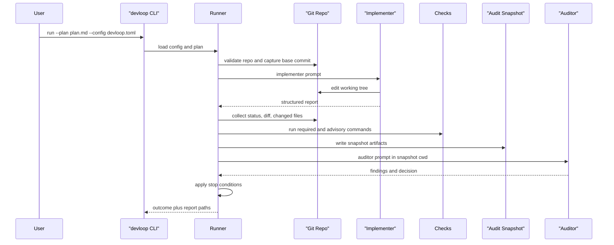

# Architecture

## Overview

`devloop` is a single-process Python CLI that coordinates a two-agent implementation loop inside a git repository.

At a high level:

1. Load config and plan.
2. Validate repo and tool preconditions.
3. Run the implementer in the live repo.
4. Capture diffs, changed files, and deterministic check results.
5. Build a review snapshot.
6. Run the auditor in that snapshot.
7. Decide whether to continue, succeed, fail, or stall.
8. Optionally commit and always write a final report.

## Sequence



## Major components

### `cli.py`

- parses CLI arguments
- dispatches commands
- maps exceptions to exit codes

### `config.py`

- loads TOML from disk
- validates it through Pydantic models

### `models.py`

- defines config, plan, run, agent, finding, check, and outcome schemas
- centralizes enum values used across the package

### `plan_parser.py`

- extracts a simple structured plan from Markdown
- preserves the raw plan body for prompts and artifacts

### `runner.py`

- orchestrates the end-to-end loop
- writes prompts and responses to artifacts
- coordinates git capture, checks, and audit snapshots
- computes stop conditions and final outcome

### `git_ops.py`

- wraps git commands used by the runner
- computes changed files and diffs against the base commit
- includes untracked files in diff-aware behavior

### `checks.py`

- runs required and advisory commands
- normalizes timeout behavior into command results

### `prompts.py`

- renders implementer and auditor prompts
- embeds the JSON marker contract expected from agents

### `report.py`

- formats the final Markdown report
- builds the default commit message

## Artifact model

Each run gets its own artifact directory, usually:

```text
.devloop/runs/<run_id>/
```

Within that directory:

- `run_spec.json` captures the normalized run contract
- each `rounds/<n>/` directory captures prompts, raw outputs, patches, changed files, snapshots, and findings
- `report.md` and `report.json` summarize the final result

The artifact model is intentionally append-only for the duration of a run. This makes debugging and postmortems much easier.

## Trust boundaries

The runner treats different inputs with different trust levels:

- Git state and check exit codes are hard facts.
- Structured JSON from agents is trusted only after marker extraction and schema validation.
- Freeform prose around the JSON is retained as artifacts but not used for orchestration decisions.

## Stop conditions

The loop currently stops early when:

- required checks pass and no blocking findings remain
- there is no material diff in a round
- the same non-empty finding set repeats without progress

After the loop, required checks are run again before the final outcome is emitted.

## Current design tradeoffs

- The implementation is intentionally simple and synchronous.
- Artifact storage is filesystem-based rather than database-backed.
- The agent adapter is generic rather than tuned to specific CLIs.
- The auditor is snapshot-based to reduce accidental repo mutation.

## Known future improvements

- dedicated adapters for `claude -p` and `codex exec`
- resumable runs
- smarter retry and backoff behavior
- artifact path exclusion from diffs even when `.devloop/` is not gitignored
- richer final reporting and trend analysis across runs
